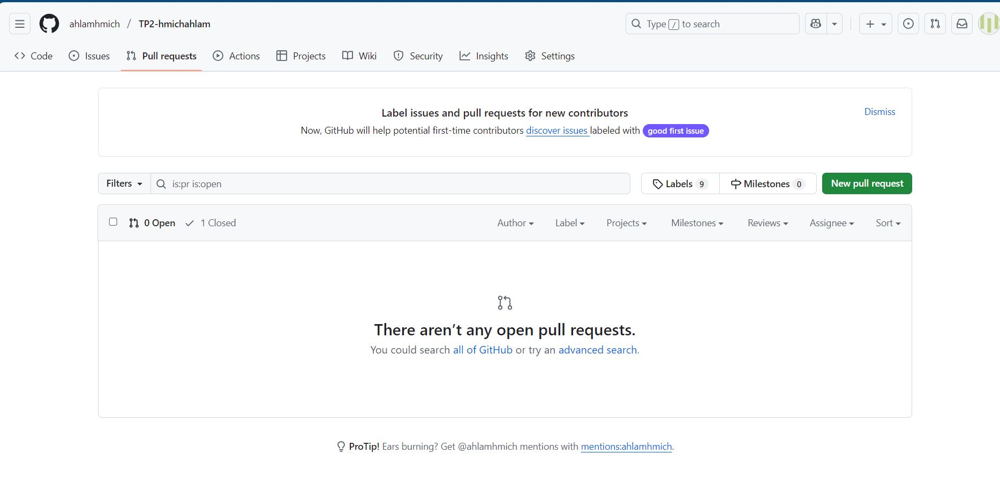
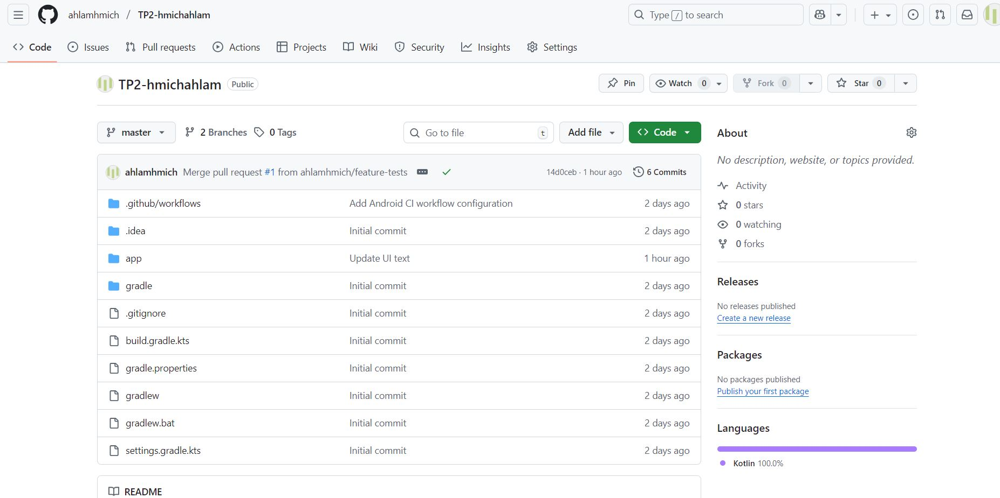
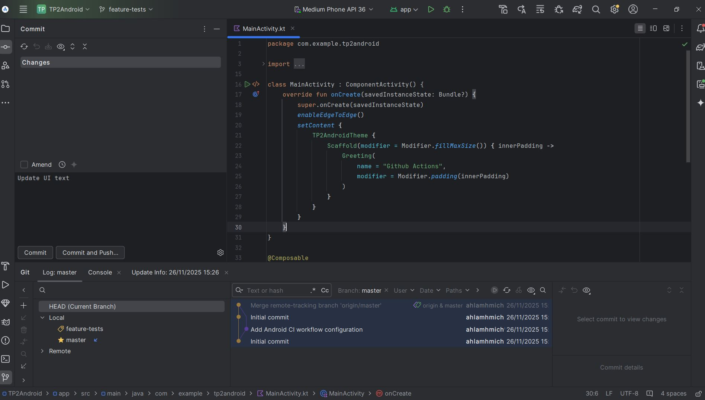
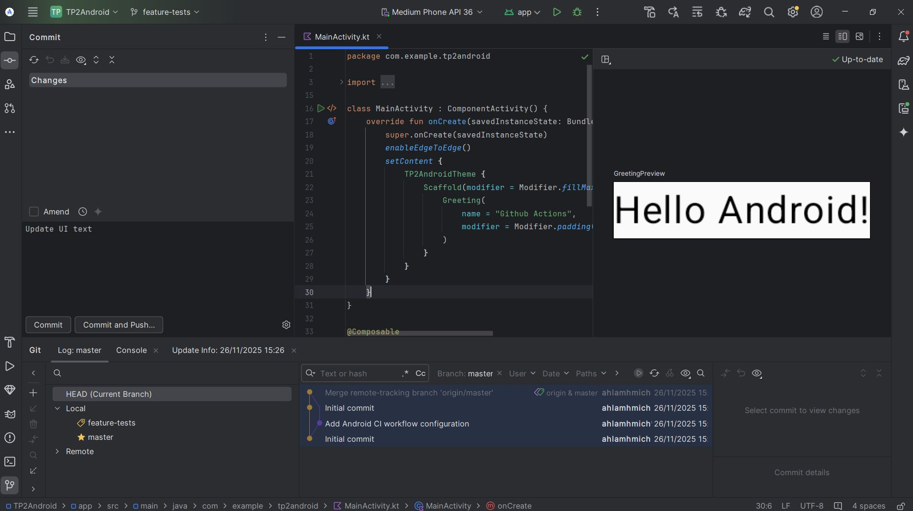
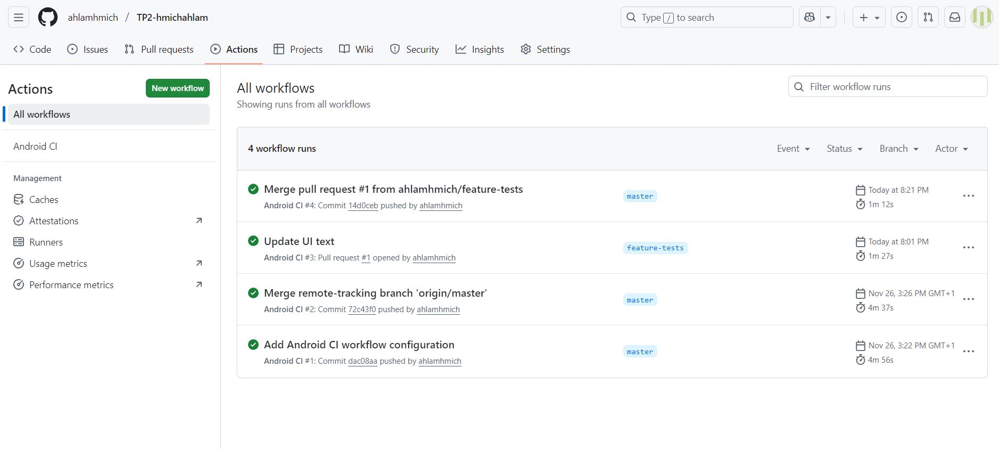

# TP2 – GitHub Actions & Android Project  
**Auteur : Ahlam Hmich**

Ce dépôt contient le travail du TP2 demandé :  
- Projet Android fonctionnel  
- Workflow GitHub Actions ajouté  
- Captures d’écran intégrées  
- Rapport simplifié  
- Dépôt nommé correctement  

---

##  1. Application Android – Preuve de compilation réussie

L'application compile et s'exécute sans erreurs.  
Voici la capture de l’interface Android Studio :

---

##  2. Workflow GitHub Actions

Le workflow CI/Build est situé dans :
.github/workflows/android-ci.yml

Il vérifie automatiquement :
- la compilation du projet  
- le build Gradle  
- les tests unitaires  

Voici les captures des workflows exécutés avec succès :

---

## 3. Pull Request & Branches

Une branche **feature-tests** a été créée pour modifier l'interface.  
Ensuite, une Pull Request a été créée et mergée dans `master`,  
ce qui a déclenché le workflow automatiquement.

---

## 4. Mini Rapport du TP

###  Objectif
Ce TP permet de comprendre :
- comment travailler avec Git & GitHub  
- comment créer et gérer des branches  
- comment utiliser GitHub Actions pour automatiser le build Android  
- comment insérer des captures dans un README en Markdown  

###  Travail réalisé
1. Création du dépôt **TP2-hmicahlam**  
2. Création du projet Android (Empty Activity)  
3. Ajout du workflow GitHub Actions  
4. Création d'une branche `feature-tests`  
5. Modification, commit + push  
6. Création d’une Pull Request  
7. Validation et merge  
8. Captures ajoutées dans `/images`  
9. README final complété  

###  Résultat Final
Le projet compile sans problème,  
les workflows CI fonctionnent parfaitement,  
et toutes les captures sont intégrées dans ce README.

---

